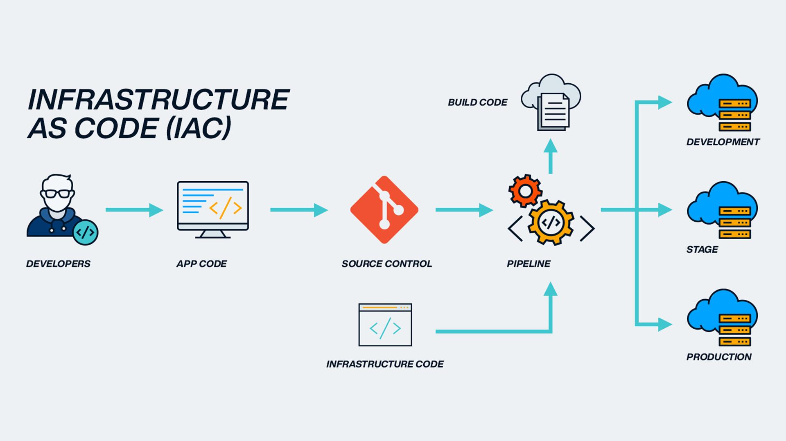

% Pulumi 101
% Robert Ward <robert@rtward.com>
%<br/>Talk: [${TALK_URL}](${TALK_URL})<br/>Repo: [${REPO_URL}](${REPO_URL})

# Pulumi 101

# The old way


::: notes

Doing things manually, clicking around on cloud consoles, and typing into terminals

:::

# The new way



::: notes

Describe how you want things to be, and let the system make it right

:::

# What is Pulumi?

- Write IaC in a common language
- Wide support for resource types
- Supports easy "dynamic" resource types

::: notes

Supports Python, TypeScript, C#, and Go
Supports Terraform providers so you can leverage that ecosystem
Can make your own resources / providers fairly easily

:::

# Compared to Terraform

- More flexible

::: notes

- You have a full programming language available instead of a DSL

:::

# Compared to CloudFormation

 - It's multi-cloud

::: notes

- You're not limited to just AWS

:::

# Compared to Ansible

- Apples and Oranges

::: notes

- Ansible is primarily for manageing machines
- Pets vs Cattle

:::

# Key Concepts

# Stacks

- Highest level "Unit" for Pulumi
- You deploy a Stack
- Can have multiple deployments per stack

# Resources

- Represents a single "thing"
- e.g. An S3 bucket, a VM, a password, or a template file

# Component Resources

- Represents a collection of resources
- For reusibility 

# Providers

- Turn a resource definition into reality

# Dynamic Resources / Providers 

- Custom providers and resources

# State Management

- Where the current state of your system is stored
- Different from Terraform

::: notes

- In Pulumi, your state is not dynamic
- State is assumed to not change between runs
- Must be refreshed manually
- Can be S3, Pulumi Cloud, Local Files, etc.

:::

# Getting Started

# Install Pulumi

- From your package manager
  - Homebrew
  - Apt
  - Pacman
- From the [website](https://www.pulumi.com/docs/iac/download-install/)

# Set up your state management

- Local filesystem: `pulumi login --local`
- S3: `pulumi login s3://<bucket-name>`
- Pulumi Cloud: `pulumi login`

# Init your project

- `mkdir my-project`
- `cd my-project`
- List Templates `pulumi new -l`
- AWS Project `pulumi new aws-typescript`
- Minimal Project `pulumi new typescript`

# Project Structure

## `index.ts`

```
import * as pulumi from "@pulumi/pulumi";
import * as aws from "@pulumi/aws";
import * as awsx from "@pulumi/awsx";

// Create an AWS resource (S3 Bucket)
const bucket = new aws.s3.BucketV2("my-bucket");

// Export the name of the bucket
export const bucketName = bucket.id;
```

::: notes

- This is your actual project
- This is createing and S3 bucket and exporting the bucket ID

:::

## `Pulumi.yaml`

```
name: aws-example
description: A minimal AWS TypeScript Pulumi program
runtime:
  name: nodejs
  options:
    packagemanager: npm
config:
  pulumi:tags:
    value:
      pulumi:template: aws-typescript
```

::: notes

- This is the config for your project as a whole

:::

## `Pulumi.dev.yaml`

```
encryptionsalt: v1:/rfAG+6eIEo=:v1:B+XvePLoOv6fs7eE:Bal8OFpnxH+fXO98vWy2xCbvGUm7Zg==
config:
  aws:region: us-east-1
```

::: notes

- This is the config for a specific stack
- e.g. dev, prod, release, testing, etc.

:::

# Deploying

## Preview

- `pulumi preview`

::: notes

- Will ask you to select the stack
- Shows you the things it's going to do

:::

## Up

- `pulumi up`

::: notes

- Will ask you to select the stack
- Shows you the things it's going to do
- Asks for confirmation to do the things
- Applies the stack

:::

## Down 

- `pulumi down`

::: notes

- Tear down a stack

:::

# Practical AWS Example

# Practical Homelab Example

# Q&A and Further Learning
- Common questions
- Recommended learning resources
- Community forums and support channels
- Future of infrastructure as code

---

Robert Ward <robert@rtward.com>


Talk: [${TALK_URL}](${TALK_URL})

Repo: [${REPO_URL}](${REPO_URL})
